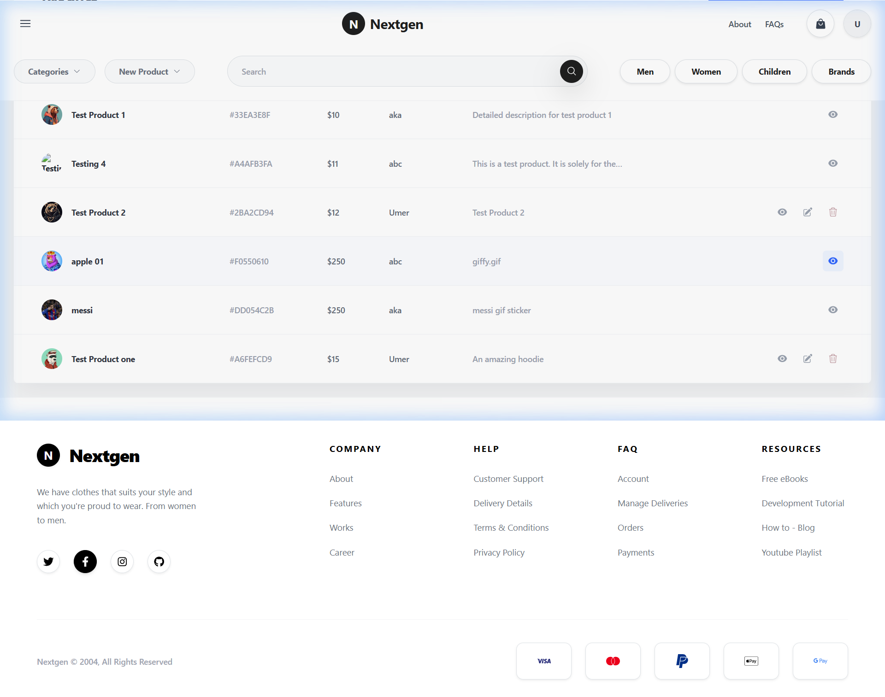
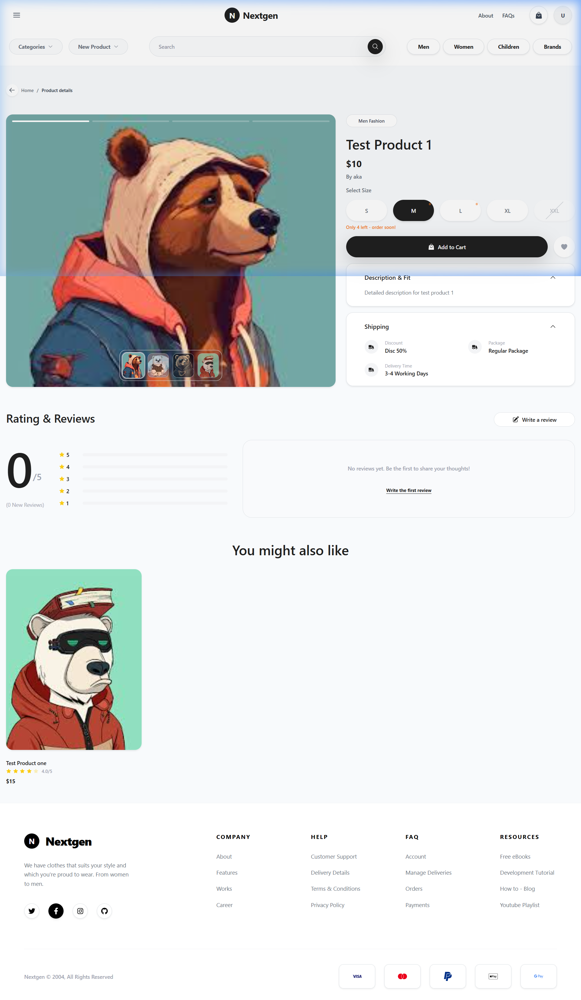
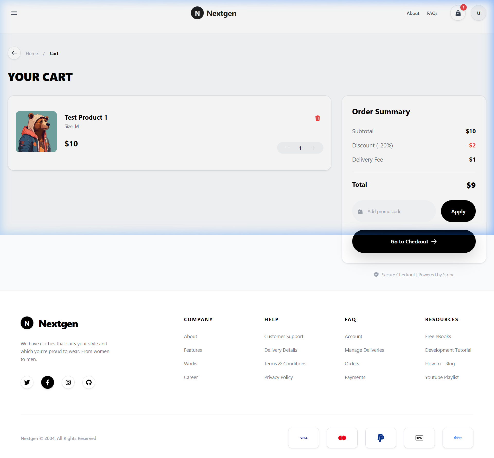
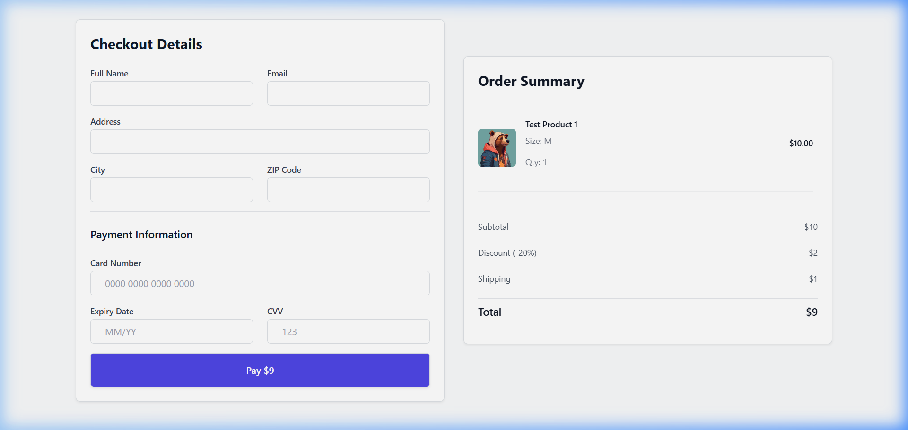

# Modern E-Commerce & Inventory Management System (MERN)

A premium, full-stack MERN (MongoDB, Express, React, Node.js) application designed for a seamless e-commerce experience. This platform combines robust user authentication with advanced shopping features, including persistent carts, stock management, and a dynamic promo code system.

## 📸 Application Preview

Here is a visual showcase of the premium user experience:

### 🖥️ Dashboard & Catalog
A state-of-the-art catalog displaying available items with interactive wishlist buttons, real-time reviews, and a URL-driven product search filter.


### 🏷️ Product Details & Inventory
Premium product details page highlighting multi-size stock level validation, dynamic "Out of Stock" alerts, and responsive size selection.


### 🛒 Persistent Cart Management
A glassmorphic cart experience showing items, dynamic tax/delivery calculations, and a promo code engine (e.g., use **`SAVE10`** for a 10% discount).


### 💳 Simulated Checkout Flow
Intuitive, seamless checkout flow requesting shipping info and card details, dynamically updating transaction records in LocalStorage.


## 🚀 Key Features

### 🛒 Shopping Experience
- **Persistent Shopping Cart**: State-of-the-art global cart management using React Context API and LocalStorage. Carts are isolated per user account.
- **Real-Time Stock Validation**: Prevents users from adding more items than are physically available in the inventory.
- **Promo Code System**: Functional discount engine (e.g., use code **`SAVE10`** for 10% off).
- **Interactive Wishlist**: Save favorite products to a personalized wishlist.
- **Dynamic Order Summary**: Automated calculation of subtotals, tax, delivery fees, and discounts with high-precision rounding.
- **Simulated Checkout Flow**: Full checkout experience with shipping detail forms, card processing validation, and dynamic calculation persistence via LocalStorage.

### 🔐 Authentication & Security
- **JWT-Based Auth**: Secure session management with JSON Web Tokens.
- **User Isolation**: Personal data (carts, wishlists, products) is securely separated between accounts.
- **Protected Routes**: Dashboard and shopping pages are restricted to authenticated users.
- **Password Security**: Bcrypt hashing for industry-standard password protection.

### 🛠 Product & Inventory Management
- **Full CRUD Support**: Add, Edit, View, and Delete products with ease.
- **Granular Permissions**: Users can only modify or delete products they personally created.
- **Multi-Size Management**: Track stock levels individually for different sizes (S, M, L, XL, XXL).
- **Image Uploads**: Support for multiple product images with automated server-side storage.
- **Inventory Autoclean**: Automatically decrements stock on purchase. If all sizes are sold out (stock = 0), the product is auto-removed from the database.

### 🎨 Premium UI/UX
- **Responsive Design**: Fully optimized for Desktop, Tablet, and Mobile.
- **Toast Notifications**: Real-time feedback for all user actions (Add to cart, login, errors).
- **Search & Filtering**: URL-driven search engine to find products across the platform instantly.
- **Glassmorphic Navigation**: High-end navigation bar with real-time cart item counts.

---

## 🛠 Tech Stack

**Frontend**
- **Core**: React 19, React Router 7
- **State Management**: React Context API (Global Cart & Auth)
- **Styling**: Tailwind CSS & Vanilla CSS (Premium Aesthetics)
- **UI Components**: React Bootstrap, React Icons, Lucide-style iconography
- **Feedback**: React Toastify

**Backend**
- **Server**: Node.js, Express.js
- **Database**: MongoDB (Atlas)
- **Validation**: Joi (Server-side schema validation)
- **File Handling**: Multer (Product image uploads)

---

## 📂 Project Structure

```text
mern-auth-app/
├── backend/
│   ├── src/
│   │   ├── controllers/   # Logic for Auth and Products
│   │   ├── middlewares/   # Auth and Validation middleware
│   │   ├── models/        # Mongoose schemas (User, Product)
│   │   └── routes/        # API Endpoints
│   └── uploads/           # Stored product images
└── frontend/
    ├── src/
    │   ├── components/    # Reusable UI (Header, Footer, RefreshHandler)
    │   ├── context/       # Global State (CartContext)
    │   ├── pages/         # View components (Dashboard, Cart, Wishlist, ProductPage, CheckoutPage)
    │   └── utils/         # Helper functions and API config
```

---

## ⚙️ Installation & Setup

### 1. Prerequisites
- Node.js installed
- MongoDB connection string (Local or Atlas)

### 2. Clone the Repository
```bash
git clone https://github.com/MuhammadUmerSajawal/Authentication-and-Product-Listing-System-MERN.git
cd Authentication-and-Product-Listing-System-MERN
```

### 3. Backend Setup
Create a `.env` file in the `backend` folder:
```env
PORT=8080
MONGO_URI=your_mongodb_connection_string
JWT_SECRET=your_secret_key
```
Install dependencies and start:
```bash
cd backend
npm install
npm start
```

### 4. Frontend Setup
```bash
cd ../frontend
npm install
npm start
```

---

## 📑 API Reference

### Authentication
| Method | Endpoint | Description |
| --- | --- | --- |
| POST | `/auth/signup` | Register new user |
| POST | `/auth/login` | Login & receive JWT |

### Products
| Method | Endpoint | Description |
| --- | --- | --- |
| GET | `/products` | Fetch all products |
| POST | `/products` | Add new product (Auth Required) |
| PUT | `/products/:id` | Update product details |
| DELETE | `/products/:id` | Remove product (Creator Only) |
| POST | `/products/checkout` | Purchase items (reduces stock / deletes if sold out) |

---

## 📝 License
This project is for educational purposes as part of a MERN stack internship.

**Author:** Muhammad Umer Sajawal
